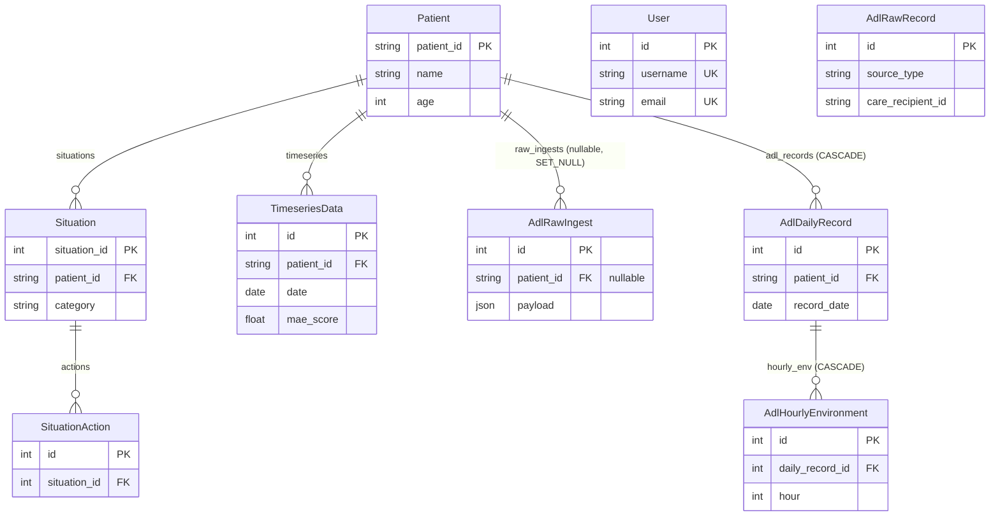

# 데이터베이스 스키마 — salpyeobom-backend

> 고령자 원격 모니터링 백엔드의 전체 DB 스키마 레퍼런스.
> AI 에이전트가 `app/models/` 의 4개 파일을 일일이 읽지 않고도 스키마·관계·필드 의미를
> 한 번에 파악하도록 작성되었다. **모델 코드를 변경하면 이 문서도 함께 갱신할 것.**

---

## 1. 개요

| 항목 | 값 |
|------|----|
| DBMS | PostgreSQL |
| ORM | Tortoise ORM (async) + asyncpg |
| 마이그레이션 | Aerich |
| 테이블 수 | 8개 (+ `aerich` 마이그레이션 추적 테이블, 자동 생성) |

### 모델 파일 ↔ 테이블 매핑

| 모델 파일 | 모델 클래스 | 테이블명 | 도메인 |
|-----------|------------|----------|--------|
| `app/models/user.py` | `User` | `users` | 인증 |
| `app/models/patient.py` | `Patient` | `patients` | 환자/모니터링 |
| `app/models/patient.py` | `Situation` | `situations` | 환자/모니터링 |
| `app/models/patient.py` | `SituationAction` | `situation_actions` | 환자/모니터링 |
| `app/models/patient.py` | `TimeseriesData` | `timeseries_data` | 환자/모니터링 |
| `app/models/adl.py` | `AdlRawIngest` | `adl_raw_ingest` | ADL 파이프라인 |
| `app/models/adl.py` | `AdlDailyRecord` | `adl_daily_records` | ADL 파이프라인 |
| `app/models/adl.py` | `AdlHourlyEnvironment` | `adl_hourly_environment` | ADL 파이프라인 |
| `app/models/adl_raw.py` | `AdlRawRecord` | `adl_raw_records` | ADL 원시 샘플 |

모델 등록은 `app/database.py` 의 `MODELS` 리스트에서 관리된다.

---

## 2. ERD (관계도)



**관계 없는 독립 테이블**

- `User` — 인증 전용. 다른 테이블과 FK 없음.
- `AdlRawRecord` — 엑셀 샘플 원시 데이터 적재용 독립 테이블. 운영 환자(`patients`)와 분리됨.

---

## 3. 테이블 상세

### 도메인 1 — 인증

#### `users` (`User`)

서비스 로그인 계정. 환자(`patients`)와는 무관한 운영자/관리자 계정이다.

| 필드 | 타입 | 제약 | 의미 | 예시값 |
|------|------|------|------|--------|
| `id` | int | PK, auto | 사용자 고유 ID | `1` |
| `username` | varchar(64) | UNIQUE, NOT NULL | 로그인 사용자명 | `"manager01"` |
| `email` | varchar(255) | UNIQUE, NOT NULL | 이메일 주소 | `"manager@example.com"` |
| `hashed_password` | varchar(255) | NOT NULL | bcrypt 해시된 비밀번호 | `"$2b$12$..."` |
| `is_active` | bool | default `true` | 계정 활성화 여부 | `true` |
| `created_at` | timestamptz | auto_now_add | 생성 시각 (자동) | `2026-05-18T09:00:00Z` |

---

### 도메인 2 — 환자 / 모니터링

#### `patients` (`Patient`)

모니터링 대상 고령자. **스키마의 허브 테이블**로, 상황·시계열·ADL 데이터가 모두 이 테이블을 참조한다.
PK가 정수 auto-increment가 아닌 **외부 시스템 ID 문자열**(`patient_id`)임에 주의.

| 필드 | 타입 | 제약 | 의미 | 예시값 |
|------|------|------|------|--------|
| `patient_id` | varchar(64) | PK | 환자 고유 ID (외부 시스템 ID) | `"user_1001"`, `"NOR_001"` |
| `name` | varchar(64) | NOT NULL | 환자 이름 | `"김순자"` |
| `age` | int | NOT NULL | 나이 | `78` |
| `address_full` | varchar(255) | NOT NULL | 전체 주소 | `"서울특별시 노원구 상계동 123-4"` |
| `address_summary` | varchar(128) | NOT NULL | 요약 주소 (목록 표시용) | `"노원구 상계동"` |
| `profile_image_url` | varchar(512) | null | 프로필 이미지 URL | `null` |
| `doc_no` | varchar(64) | null | 의료 기록 번호 | `null` |
| `phone_number` | varchar(20) | null | 전화번호 | `"010-1234-5678"` |
| `manager_name` | varchar(64) | null | 담당 관리자명 | `"이영희"` |
| `management_level` | varchar(64) | null | 관리 등급 | `"집중 관리군 (1등급)"`, `"자립 관리군 (3등급)"` |
| `diseases` | jsonb | default `[]` | 질병 목록 (문자열 배열) | `["고혈압", "초기 치매", "관절염"]` |
| `next_visit_time` | varchar(64) | null | 다음 방문 시간 | `"2026-05-22 14:00"` |
| `next_visit_plan` | text | null | 다음 방문 계획 메모 | `"혈압약 처방 확인"` |

**역참조**: `situations`, `timeseries`, `raw_ingests`, `adl_records`

#### `situations` (`Situation`)

환자에게 발생한 모니터링 이벤트(낙상·미응답·이상 패턴 등). 환자 1 : N 상황.

| 필드 | 타입 | 제약 | 의미 | 예시값 |
|------|------|------|------|--------|
| `situation_id` | int | PK, auto | 상황 고유 ID | `1` |
| `patient_id` | varchar(64) | FK → `patients`, NOT NULL | 대상 환자 (related_name `situations`) | `"user_1001"` |
| `category` | varchar(32) | NOT NULL | 상황 분류 | `"낙상 의심"`, `"미응답"`, `"이상 패턴"`, `"사망 감지"` |
| `detail_reason` | text | null | 상세 사유 | `"3시간 무동작 감지"` |
| `occurred_at` | timestamptz | NOT NULL | 발생 시각 | `2026-04-08T11:33:45Z` |
| `action_status` | varchar(16) | default `"조치 대기"` | 조치 진행 상태 | `"조치 대기"`, `"현장 출동"`, `"조치 완료"` |
| `is_active` | bool | default `true` | 활성(미해결) 여부 | `true` |
| `created_at` | timestamptz | auto_now_add | 레코드 생성 시각 | `2026-04-08T11:34:00Z` |

**역참조**: `actions`

#### `situation_actions` (`SituationAction`)

특정 상황에 대해 취해진 조치 기록. 상황 1 : N 조치.

| 필드 | 타입 | 제약 | 의미 | 예시값 |
|------|------|------|------|--------|
| `id` | int | PK, auto | 조치 고유 ID | `1` |
| `situation_id` | int | FK → `situations`, NOT NULL | 대상 상황 (related_name `actions`) | `1` |
| `action_type` | varchar(16) | NOT NULL | 조치 유형 | `"유선 연락"`, `"방문 상담"` |
| `action_note` | text | null | 조치 메모 | `"보호자에게 연락 완료"` |
| `status_update` | varchar(16) | NOT NULL | 조치 후 갱신된 상태 | `"조치 완료"` |
| `created_at` | timestamptz | auto_now_add | 조치 기록 시각 | `2026-04-08T12:00:00Z` |

#### `timeseries_data` (`TimeseriesData`)

환자별 일자별 이상탐지 점수 시계열. 추세 그래프용. 환자 1 : N.

| 필드 | 타입 | 제약 | 의미 | 예시값 |
|------|------|------|------|--------|
| `id` | int | PK, auto | 데이터 포인트 ID | `1` |
| `patient_id` | varchar(64) | FK → `patients`, NOT NULL | 대상 환자 (related_name `timeseries`) | `"user_1001"` |
| `date` | date | NOT NULL | 데이터 날짜 | `2026-05-18` |
| `mae_score` | float | NOT NULL | MAE(이상탐지) 점수 | `1.25` |
| `is_anomaly` | bool | default `false` | 이상 판정 여부 | `false` |

---

### 도메인 3 — ADL 파이프라인

ADL(Activities of Daily Living, 일상생활활동) 데이터를 3단계로 저장한다:

```
adl_raw_ingest        원본 JSON 임시 저장 (개발용, AI 파이프라인 완성 후 삭제 예정)
       ↓ (집계)
adl_daily_records     일별 집계 피처 — AI 학습/예측 입력값
       ↓ (1:24)
adl_hourly_environment 시간별 환경 센서 (하루 24행)
```

#### `adl_raw_ingest` (`AdlRawIngest`)

디바이스에서 수신한 원본 ADL JSON 페이로드 임시 저장소.
⚠️ **개발용 임시 테이블** — AI 파이프라인 완성 후 삭제 예정.

| 필드 | 타입 | 제약 | 의미 | 예시값 |
|------|------|------|------|--------|
| `id` | int | PK, auto | 레코드 ID | `1` |
| `patient_id` | varchar(64) | FK → `patients`, **null**, on_delete **SET_NULL** | 대상 환자 (related_name `raw_ingests`) | `"user_1001"` |
| `device_id` | varchar(32) | NOT NULL | 디바이스 ID | `"DEV-0042"` |
| `gateway_mac` | varchar(20) | NOT NULL | 게이트웨이 MAC 주소 | `"AA:BB:CC:DD:EE:FF"` |
| `received_at` | timestamptz | auto_now_add | 서버 수신 시각 | `2026-05-18T03:00:00Z` |
| `device_ts` | timestamptz | NOT NULL | 디바이스 측 타임스탬프 | `2026-05-18T02:59:50Z` |
| `payload` | jsonb | NOT NULL | 원본 JSON 페이로드 | `{"sleep": {...}, "bath": {...}}` |
| `is_processed` | bool | default `false` | 집계 처리 완료 여부 | `false` |

#### `adl_daily_records` (`AdlDailyRecord`)

환자별 하루치 ADL 집계 피처. AI 이상탐지 모델의 입력값.

> `unique_together = (patient, record_date)` — 환자별 날짜당 1행만 존재.
> on_delete **CASCADE** — 환자 삭제 시 함께 삭제됨.

| 필드 | 타입 | 제약 | 의미 | 예시값 |
|------|------|------|------|--------|
| `id` | int | PK, auto | 레코드 ID | `1` |
| `patient_id` | varchar(64) | FK → `patients`, CASCADE | 대상 환자 (related_name `adl_records`) | `"NOR_001"` |
| `record_date` | date | NOT NULL, UNIQUE(+patient) | 기록 날짜 | `2026-05-18` |
| **수면** | | | | |
| `sleep_start_time` | varchar(8) | null | 수면 시작 시각 (HH:MM) | `"22:30"` |
| `sleep_end_time` | varchar(8) | null | 수면 종료 시각 (HH:MM) | `"06:45"` |
| `total_sleep_period` | float | null | 총 수면 시간 (분) | `420.5` |
| `total_sleep_aix_ratio` | float | null | 수면 중 AIX(활동) 비율 | `0.045` |
| `aix_score` | float | null | 일일 활동 지수 (AIX) | `250.1` |
| **외출** | | | | |
| `outgoing_count` | int | null | 외출 횟수 | `5` |
| `outgoing_time` | float | null | 외출 시간 합계 (분) | `150.0` |
| `outgoing_late_night_count` | int | null | 심야 외출 횟수 | `0` |
| `outgoing_late_night_time` | float | null | 심야 외출 시간 합계 (분) | `0.0` |
| **욕실** | | | | |
| `bath_count` | int | null | 목욕 횟수 | `8` |
| `bath_time` | float | null | 목욕 시간 합계 (분) | `120.5` |
| `bath_nomove_time` | float | null | 욕실 내 무동작 시간 (분) | `15.3` |
| `bath_count_in_sleep` | int | null | 수면 시간대 목욕 횟수 | `0` |
| `total_bath_average_count` | float | null | 누적 목욕 평균 횟수 | `6.5` |
| **AI 분석 결과** | | | | |
| `mae_score` | float | null | MAE(이상탐지) 점수 | `1.25` |
| `is_anomaly` | bool | default `false` | 이상 판정 여부 | `false` |
| `created_at` | timestamptz | auto_now_add | 레코드 생성 시각 | `2026-05-18T04:00:00Z` |

**역참조**: `hourly_env`

#### `adl_hourly_environment` (`AdlHourlyEnvironment`)

`adl_daily_records` 1행에 대응하는 시간별 환경 센서 측정값. 하루당 24행(0~23시).

> `unique_together = (daily_record, hour)` — 일별 레코드당 시간별 1행.
> on_delete **CASCADE** — 일별 레코드 삭제 시 함께 삭제됨.

| 필드 | 타입 | 제약 | 의미 | 예시값 |
|------|------|------|------|--------|
| `id` | int | PK, auto | 레코드 ID | `1` |
| `daily_record_id` | int | FK → `adl_daily_records`, CASCADE | 대상 일별 레코드 (related_name `hourly_env`) | `1` |
| `hour` | int | NOT NULL, UNIQUE(+daily_record) | 시간 (0~23) | `14` |
| `temperature` | float | null | 온도 (℃) | `27.8` |
| `humidity` | float | null | 습도 (%) | `61.5` |
| `illuminance` | float | null | 조도 (lux) | `28.0` |

---

### 도메인 4 — ADL 원시 샘플

#### `adl_raw_records` (`AdlRawRecord`)

데이터바우처 지원사업 엑셀 샘플(응급/사망 발생 ADL)을 적재하는 독립 테이블.
운영 환자(`patients`)와 FK 관계 없이 분리되어 있으며, AI 모델 학습/검증용 참조 데이터로 쓰인다.
컬럼이 54개로 많아 하위 그룹별로 표를 나눈다. 적재는 `notebooks/adl_raw_ingest.ipynb` 가
담당하며, 엑셀의 hex 문자열 컬럼은 정수 리스트로 디코딩해 배열 컬럼에 저장한다.

**기본 정보**

| 필드 | 타입 | 제약 | 의미 | 예시값 |
|------|------|------|------|--------|
| `id` | int | PK, auto | 레코드 ID | `1` |
| `source_type` | varchar(4) | NOT NULL | 이벤트 타입 | `"응급"`, `"사망"` |
| `care_recipient_id` | varchar(32) | NOT NULL | 돌봄 대상자 ID | `"R-00123"` |
| `age` | int | null | 나이 | `82` |
| `sex` | varchar(1) | null | 성별 | `"M"`, `"F"` |
| `alone` | varchar(1) | null | 독거 여부 | `"Y"`, `"N"` |
| `vision` | varchar(16) | null | 시력 상태 | `"양호"` |
| `hearing` | varchar(16) | null | 청력 상태 | `"양호"` |
| `dosage` | varchar(16) | null | 약물 복용 상태 | `"3종"` |
| `district` | varchar(64) | null | 거주 지역 | `"노원구"` |
| `house_structure` | varchar(16) | null | 주택 구조 | `"아파트"` |
| `room_no` | int | null | 방 개수 | `2` |
| `bath_location` | varchar(16) | null | 욕실 위치 | `"실내"` |

**이벤트 정보**

| 필드 | 타입 | 제약 | 의미 | 예시값 |
|------|------|------|------|--------|
| `lifeog_date` | date | null | 생활 기록 날짜 | `2026-03-10` |
| `emergency_date` | date | null | 응급 발생 날짜 | `2026-03-10` |
| `emergency_record` | text | null | 응급 기록 상세 | `"욕실에서 낙상"` |
| `occurrence_place` | varchar(32) | null | 발생 장소 | `"욕실"` |
| `on_site` | varchar(16) | null | 현장 조치 여부 | `"Y"` |
| `hospital_transfer` | varchar(16) | null | 병원 이송 여부 | `"Y"` |
| `hospital_treatment` | varchar(16) | null | 병원 치료 여부 | `"입원"` |
| `death_date` | date | null | 사망 날짜 | `2026-03-12` |
| `death_record` | text | null | 사망 기록 상세 | `"심정지"` |

**AIX 분석 데이터**

> 배열 길이 컨벤션: `*_1_list` = 분 단위 1440개(= 60×24), `*_h_list` = 시간 단위 24개.
> 엑셀 원본은 hex 문자열(`0000…`/`FFFE…`)이며, 적재 노트북이 1바이트(`place_code`,
> `sleep_depth`, `outgoing`) 또는 2바이트 big-endian(`aix_1`, `aix_h`)으로 디코딩한다.

| 필드 | 타입 | 제약 | 의미 | 예시값 |
|------|------|------|------|--------|
| `place_code_1_list` | int[] | null | 위치 코드 시계열 (분 단위 1440개) | `[0, 0, 10, ...]` |
| `aix_1_list` | int[] | null | AIX 1차 값 (분 단위 1440개) | `[0, 12, 7, ...]` |
| `aix_h_list` | int[] | null | AIX 시간별 값 (24개) | `[18, 7, 4, ...]` |
| `aix_d` | float | null | AIX 일 단위 값 | `250.5` |
| `aix_1_eq_0_repeat_count` | int | null | AIX=0 연속 반복 횟수 | `3` |
| `total_aix_sum` | float | null | 총 AIX 합계 | `1820.4` |
| `total_aix_inc_ratio` | float | null | 총 AIX 증가 비율 | `0.12` |
| `night_aix_ratio` | float | null | 야간 AIX 비율 | `0.08` |
| `total_age_aix_ratio` | float | null | 나이대 대비 AIX 비율 | `0.95` |

**수면 데이터**

| 필드 | 타입 | 제약 | 의미 | 예시값 |
|------|------|------|------|--------|
| `sleep_depth_1_list` | int[] | null | 수면 깊이 시계열 (분 단위 1440개) | `[4, 4, 3, ...]` |
| `sleep_start_time_d` | varchar(8) | null | 수면 시작 시각 (HH:MM) | `"22:30"` |
| `sleep_end_time_d` | varchar(8) | null | 수면 종료 시각 (HH:MM) | `"06:45"` |
| `total_sleep_period` | float | null | 총 수면 시간 (분) | `420.5` |
| `total_sleep_aix_ratio` | float | null | 수면 중 AIX 비율 | `0.045` |

**목욕 데이터**

| 필드 | 타입 | 제약 | 의미 | 예시값 |
|------|------|------|------|--------|
| `bath_count_d` | int | null | 일일 목욕 횟수 | `8` |
| `bath_time_d` | float | null | 일일 목욕 시간 (분) | `120.5` |
| `bath_nomove_time` | float | null | 욕실 내 무동작 시간 (분) | `15.3` |
| `bath_count_in_sleep` | int | null | 수면 시간대 목욕 횟수 | `0` |
| `bath_time_per_count` | float | null | 회당 목욕 시간 (분) | `15.0` |
| `total_bath_average_count` | float | null | 누적 목욕 평균 횟수 | `6.5` |

**외출 데이터**

| 필드 | 타입 | 제약 | 의미 | 예시값 |
|------|------|------|------|--------|
| `outgoing_1_list` | int[] | null | 외출 시계열 (분 단위 1440개) | `[255, 254, 254, ...]` |
| `outgoing_count_d` | int | null | 일일 외출 횟수 | `5` |
| `outgoing_time_d` | float | null | 일일 외출 시간 (분) | `150.0` |
| `outgoing_late_night_count_d` | int | null | 일일 심야 외출 횟수 | `0` |
| `outgoing_late_night_time_d` | float | null | 일일 심야 외출 시간 (분) | `0.0` |
| `last_outgoing_time` | varchar(16) | null | 마지막 외출 시각 | `"18:20"` |
| `total_outgoing_average_time` | float | null | 누적 외출 평균 시간 (분) | `135.0` |
| `total_outgoing_average_count` | float | null | 누적 외출 평균 횟수 | `4.8` |

**시간별 환경 센서** (PostgreSQL 배열, 인덱스 = 시간 0~23)

| 필드 | 타입 | 제약 | 의미 | 예시값 |
|------|------|------|------|--------|
| `temp_list` | double precision[] | null | 24시간 온도 목록 (℃) | `[22.1, 21.8, ..., 27.8]` |
| `humi_list` | double precision[] | null | 24시간 습도 목록 (%) | `[58.0, 60.2, ..., 61.5]` |
| `illu_list` | double precision[] | null | 24시간 조도 목록 (lux) | `[0.0, 0.0, ..., 28.0]` |
| `created_at` | timestamptz | auto_now_add | 레코드 생성 시각 | `2026-05-18T18:02:07Z` |

---

## 4. 설계 노트

### ADL 3중 저장 전략

ADL 데이터는 가공 단계별로 별도 테이블에 저장된다.

- **`adl_raw_ingest`** — 디바이스 원본 JSON. 개발용 임시 테이블로, AI 파이프라인이 완성되면
  삭제 예정이다. `payload` 가 가공되지 않은 jsonb 그대로다.
- **`adl_daily_records`** — 원본을 하루 단위로 집계한 피처. AI 이상탐지 모델의 직접 입력값.
  환자별 날짜당 1행(`unique_together`)이 보장된다.
- **`adl_hourly_environment`** — 일별 레코드에 딸린 시간별 환경 센서값(24행/일).

### 이상탐지 결과의 이중 저장

`mae_score` / `is_anomaly` 필드가 `timeseries_data` 와 `adl_daily_records` 양쪽에 존재한다.
모델 코드 주석에 따르면 `adl_daily_records` 의 AI 분석 필드가 **`TimeseriesData` 대체**
목적이다. 신규 코드는 `adl_daily_records` 쪽을 사용하고, `timeseries_data` 는 레거시
추세 그래프 용도로 유지된다. 어느 쪽을 갱신/조회할지 라우터별로 확인할 것.

### `adl_raw_records` 의 독립성

`adl_raw_records` 는 데이터바우처 엑셀 샘플 적재 전용으로, 운영 환자(`patients`)와
FK 관계가 없다. 환자 식별자도 `care_recipient_id`(varchar)로 별도 관리된다.
운영 데이터와 섞지 말 것.

### `adl_raw_records` 데이터 품질 주의

엑셀 샘플 원본의 한계로 일부 필드는 그대로 신뢰할 수 없다. 조회·분석 시 다음 사항을
반드시 확인할 것.

- **`care_recipient_id`** — pandas 가 NaN 섞인 컬럼을 `float64` 로 읽어 `661.0` 처럼
  부동소수로 들어올 수 있다. 현재 적재 노트북은 `parse_id()` 헬퍼로 `"661"` 형태로
  정규화하지만, 과거(2026-05-19 이전) 적재본은 `"661.0"` 으로 남아 있을 수 있으니
  조인·비교 전 양쪽 표기를 확인할 것.
- **`outgoing_1_list`** — `254`/`255` 가 분 단위로 자주 나타나며, 실제 외출 코드가
  아니라 **센서 무신호/오류 sentinel** 이다. 외출 집계 시 제외할 것.
- **`night_aix_ratio`, `sleep_start_time_d`, `sleep_end_time_d`** — 원본 엑셀에서
  계산 오류·결측이 다수 관측됨. AI 입력으로 쓸 때는 별도 검증/대체값 필요.
- **`source_type = "사망"`** 파일의 일부 hex 컬럼은 정수 `0` 으로만 채워진 행이
  있어 `hex_to_int_list()` 가 `None` 을 반환한다 (디코딩 실패가 아닌 원본 결측).

---

## 5. 스키마 변경 시 주의

- 모델 스키마를 바꾸면 `uv run aerich migrate` → `make migrate` 로 마이그레이션을 생성·적용한다
  (상세 절차는 `CLAUDE.md` 의 "DB 스키마 변경 패턴" 참조).
- 모델을 변경했다면 **이 문서(`docs/database-schema.md`)도 함께 갱신**할 것.
