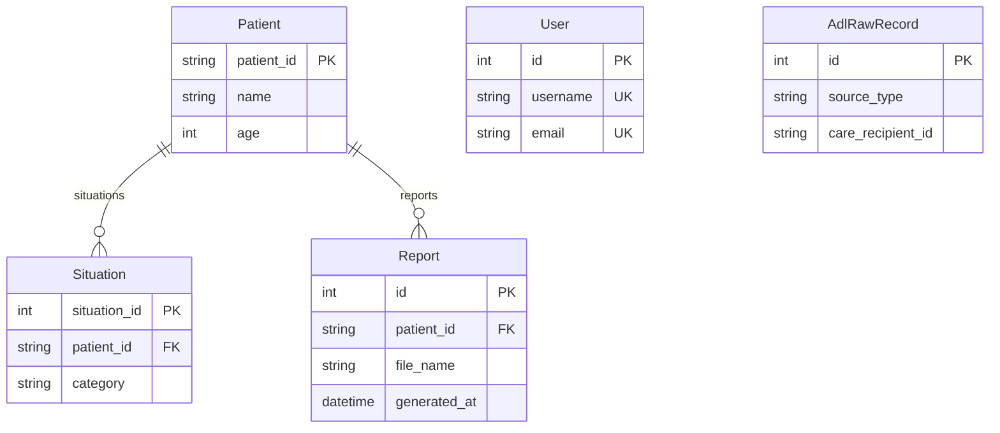

# 데이터베이스 스키마 — salpyeobom-backend

> 고령자 원격 모니터링 백엔드의 전체 DB 스키마 레퍼런스.
> AI 에이전트가 `app/models/` 의 파일을 일일이 읽지 않고도 스키마·관계·필드 의미를
> 한 번에 파악하도록 작성되었다. **모델 코드를 변경하면 이 문서도 함께 갱신할 것.**

> ⚠️ 2026-05-26 재설계 차원에서 분석 모델 3종(`TimeseriesData`, `AdlDailyRecord`,
> `AdlHourlyEnvironment`)과 조치 기록(`SituationAction`)이 제거되었다. 새 설계는
> 미정 — 결정되면 본 문서에 추가한다. 상세 정리 내역은 "운영·분석 레이어 재설계
> 진행 중" 섹션 참조.

---

## 1. 개요

| 항목 | 값 |
|------|----|
| DBMS | PostgreSQL |
| ORM | Tortoise ORM (async) + asyncpg |
| 마이그레이션 | Aerich |
| 테이블 수 | 5개 (+ `aerich` 마이그레이션 추적 테이블, 자동 생성) |

### 모델 파일 ↔ 테이블 매핑

| 모델 파일 | 모델 클래스 | 테이블명 | 도메인 |
|-----------|------------|----------|--------|
| `app/models/user.py` | `User` | `users` | 인증 |
| `app/models/patient.py` | `Patient` | `patients` | 환자/모니터링 |
| `app/models/patient.py` | `Situation` | `situations` | 환자/모니터링 |
| `app/models/report.py` | `Report` | `reports` | 환자/모니터링 |
| `app/models/adl_raw.py` | `AdlRawRecord` | `adl_raw_records` | ADL 원시 샘플 |

모델 등록은 `app/database.py` 의 `MODELS` 리스트에서 관리된다.

---

## 2. ERD (관계도)

**관계 없는 독립 테이블**

- `User` — 인증 전용. 다른 테이블과 FK 없음.
- `AdlRawRecord` — 엑셀 샘플 원시 데이터 적재용 독립 테이블. 운영 환자(`patients`)와 분리됨.

---

## 3. 테이블 상세

### 도메인 1 — 인증

#### `users` (`User`)

서비스 로그인 계정. 환자(`patients`)와는 무관한 운영자/관리자 계정이다.

| 필드 | 타입 | 제약 | 의미 | 예시값 |
|------|------|------|------|--------|
| `id` | int | PK, auto | 사용자 고유 ID | `1` |
| `username` | varchar(64) | UNIQUE, NOT NULL | 로그인 사용자명 | `"manager01"` |
| `email` | varchar(255) | UNIQUE, NOT NULL | 이메일 주소 | `"manager@example.com"` |
| `hashed_password` | varchar(255) | NOT NULL | bcrypt 해시된 비밀번호 | `"$2b$12$..."` |
| `is_active` | bool | default `true` | 계정 활성화 여부 | `true` |
| `created_at` | timestamptz | auto_now_add | 생성 시각 (자동) | `2026-05-18T09:00:00Z` |

---

### 도메인 2 — 환자 / 모니터링

#### `patients` (`Patient`)

모니터링 대상 고령자. **스키마의 허브 테이블**로, 상황 데이터가 이 테이블을 참조한다.
PK가 정수 auto-increment가 아닌 **외부 시스템 ID 문자열**(`patient_id`)임에 주의.

| 필드 | 타입 | 제약 | 의미 | 예시값 |
|------|------|------|------|--------|
| `patient_id` | varchar(64) | PK | 환자 고유 ID (외부 시스템 ID) | `"user_1001"`, `"NOR_001"` |
| `name` | varchar(64) | NOT NULL, INDEX | 환자 이름 (검색용 인덱스) | `"김순자"` |
| `age` | int | NOT NULL | 나이 | `78` |
| `address_full` | varchar(255) | NOT NULL | 전체 주소 | `"서울특별시 노원구 상계동 123-4"` |
| `address_summary` | varchar(128) | NOT NULL | 요약 주소 (목록 표시용) | `"노원구 상계동"` |
| `phone_number` | varchar(20) | null | 전화번호 | `"010-1234-5678"` |
| `manager_name` | varchar(64) | null | 담당 관리자명 | `"이영희"` |
| `management_level` | varchar(64) | null | 관리 등급 | `"집중 관리군 (1등급)"`, `"자립 관리군 (3등급)"` |
| `diseases` | jsonb | default `[]` | 질병 목록 (문자열 배열) | `["고혈압", "초기 치매", "관절염"]` |
| `cross_verification_level` | varchar(8) | null | 교차 검증 위험등급 | `"A"`(긴급)·`"B"`(높음)·`"C"`(정상) |
| `ai_alert_title` | varchar(128) | null | AI 분석 경보 제목 | `"야간 활동 급증 — 낙상 위험"` |
| `ai_alert_desc` | text | null | AI 분석 경보 본문 | `"최근 1주 야간 AIX 비율이 2배 증가…"` |
| `doc_no` | varchar(32) | null | 전자 문서 열람 번호 | `"2026-0661"` |
| `next_visit_time` | varchar(32) | null | 다음 방문 일정 | `"2026-06-12 14:00"` |
| `next_visit_plan` | varchar(128) | null | 방문 계획 | `"혈압 측정 및 복약 점검"` |
| `profile_image_url` | varchar(255) | null | 프로필 이미지 URL | `null` |

위 7개 nullable 컬럼은 `adl_raw_records` 에서 파생된 메타로, 서브에이전트가 오프라인 1회
생성해 `data/derived/patients.jsonl` 로 고정하고 `scripts/load_derived.py` 가 적재한다.
프론트(`frontend/js/app.js`)의 환자 목록 등급 배지·상세 패널(AI 경보·방문 일정·문서번호)이
이 값을 읽는다.

**역참조**: `situations`

#### `situations` (`Situation`)

환자에게 발생한 모니터링 이벤트(낙상·미응답·이상 패턴 등). 환자 1 : N 상황.

| 필드 | 타입 | 제약 | 의미 | 예시값 |
|------|------|------|------|--------|
| `situation_id` | int | PK, auto | 상황 고유 ID | `1` |
| `patient_id` | varchar(64) | FK → `patients`, NOT NULL, INDEX | 대상 환자 (related_name `situations`) | `"user_1001"` |
| `category` | varchar(32) | NOT NULL | 상황 분류 | `"낙상 의심"`, `"미응답"`, `"이상 패턴"`, `"사망 감지"` |
| `detail_reason` | text | null | 상세 사유 | `"3시간 무동작 감지"` |
| `occurred_at` | timestamptz | NOT NULL, INDEX | 발생 시각 (정렬용 인덱스) | `2026-04-08T11:33:45Z` |
| `action_status` | varchar(16) | default `"조치 대기"`, ENUM(`ActionStatus`) | 조치 진행 상태 (활성 여부의 단일 출처 — `"조치 완료"` = 비활성, `Situation.is_active` 파생) | `"조치 대기"`, `"현장 출동"`, `"조치 완료"` |
| `created_at` | timestamptz | auto_now_add | 레코드 생성 시각 | `2026-04-08T11:34:00Z` |

#### `reports` (`Report`)

생성·발송된 위험예측 보고서 이력. 한 행 = `out/reports/` 에 생성된 보고서(PDF) 1건.
환자 1 : N 보고서. `scripts/report_generate.py` 가 생성 시 자가 등록하고,
`POST /api/v1/reports/email` 이 발송 성공 시 `emailed_at`/`emailed_to` 를 스탬프한다.

| 필드 | 타입 | 제약 | 의미 | 예시값 |
|------|------|------|------|--------|
| `id` | int | PK, auto | 보고서 고유 ID | `1` |
| `patient_id` | varchar(64) | FK → `patients`, NOT NULL, INDEX | 대상 환자 (related_name `reports`) | `"661"` |
| `title` | varchar(128) | NOT NULL | 보고서 제목 | `"661 위험예측 보고서"` |
| `file_name` | varchar(255) | NOT NULL | `out/reports/` 내 PDF 파일명 | `"위험예측보고서_661_20260607.pdf"` |
| `generated_at` | timestamptz | NOT NULL, INDEX | 보고서 일자/시각 (정렬·일자 그룹용) | `2026-06-07T00:00:00Z` |
| `emailed_at` | timestamptz | null | 이메일 발송 시각 (미발송 시 null) | `2026-06-07T09:30:00Z` |
| `emailed_to` | varchar(255) | null | 발송 수신자 | `"manager@example.com"` |
| `created_at` | timestamptz | auto_now_add | 레코드 생성 시각 | `2026-06-07T00:00:05Z` |

> **위험등급은 저장하지 않는다.** 목록의 위험/주의/사망 분류는 조회 시 FK 대상자의
> `cross_verification_level`(A→위험·B→주의·C→사망)에서 파생한다 (`app/services/reports.py:risk_of`).
> 기본 정렬은 `generated_at` 내림차순(`Meta.ordering`).

---

### 도메인 3 — ADL 원시 샘플

#### `adl_raw_records` (`AdlRawRecord`)

데이터바우처 지원사업 엑셀 샘플(응급/사망 발생 ADL)을 적재하는 독립 테이블.
운영 환자(`patients`)와 FK 관계 없이 분리되어 있으며, AI 모델 학습/검증용 참조 데이터로 쓰인다.
컬럼이 54개로 많아 하위 그룹별로 표를 나눈다. 적재는 두 노트북이 담당한다: `notebooks/adl_raw_ingest.ipynb` 는 엑셀 2종(응급/사망, 60건)을, `notebooks/adl_csv_ingest.ipynb` 는 CSV 3종(응급/평소/사망전, 각 5명 × 30일 = 450건)을 같은 테이블에 적재한다. hex 문자열 컬럼은 정수 리스트로 디코딩해 배열 컬럼에 저장한다.

**기본 정보**

| 필드 | 타입 | 제약 | 의미 | 예시값 |
|------|------|------|------|--------|
| `id` | int | PK, auto | 레코드 ID | `1` |
| `source_type` | varchar(4) | NOT NULL, INDEX | 이벤트 타입 (개방형 자유 문자열 — ENUM 미강제) | `"응급"`, `"사망"`, `"평소"`, `"사망전"` |
| `care_recipient_id` | varchar(32) | NOT NULL, INDEX | 돌봄 대상자 ID (조회용 인덱스) | `"R-00123"` |
| `age` | int | null | 나이 | `82` |
| `sex` | varchar(1) | null | 성별 | `"M"`, `"F"` |
| `alone` | varchar(1) | null | 독거 여부 | `"Y"`, `"N"` |
| `vision` | varchar(16) | null | 시력 상태 | `"양호"` |
| `hearing` | varchar(16) | null | 청력 상태 | `"양호"` |
| `dosage` | varchar(16) | null | 약물 복용 상태 | `"3종"` |
| `district` | varchar(64) | null | 거주 지역 | `"노원구"` |
| `house_structure` | varchar(16) | null | 주택 구조 | `"아파트"` |
| `room_no` | int | null | 방 개수 | `2` |
| `bath_location` | varchar(16) | null | 욕실 위치 | `"실내"` |

**이벤트 정보**

| 필드 | 타입 | 제약 | 의미 | 예시값 |
|------|------|------|------|--------|
| `lifeog_date` | date | null | 생활 기록 날짜 | `2026-03-10` |
| `emergency_date` | date | null | 응급 발생 날짜 | `2026-03-10` |
| `emergency_record` | text | null | 응급 기록 상세 | `"욕실에서 낙상"` |
| `occurrence_place` | varchar(32) | null | 발생 장소 | `"욕실"` |
| `on_site` | varchar(16) | null | 현장 조치 여부 | `"Y"` |
| `hospital_transfer` | varchar(16) | null | 병원 이송 여부 | `"Y"` |
| `hospital_treatment` | varchar(16) | null | 병원 치료 여부 | `"입원"` |
| `death_date` | date | null | 사망 날짜 | `2026-03-12` |
| `death_record` | text | null | 사망 기록 상세 | `"심정지"` |

**AIX 분석 데이터**

> 배열 길이 컨벤션: `*_1_list` = 분 단위 1440개(= 60×24), `*_h_list` = 시간 단위 24개.
> 엑셀 원본은 hex 문자열(`0000…`/`FFFE…`)이며, 적재 노트북이 1바이트(`place_code`,
> `sleep_depth`, `outgoing`) 또는 2바이트 big-endian(`aix_1`, `aix_h`)으로 디코딩한다.

| 필드 | 타입 | 제약 | 의미 | 예시값 |
|------|------|------|------|--------|
| `place_code_1_list` | int[] | null | 위치 코드 시계열 (분 단위 1440개) | `[0, 0, 10, ...]` |
| `aix_1_list` | int[] | null | AIX 1차 값 (분 단위 1440개) | `[0, 12, 7, ...]` |
| `aix_h_list` | int[] | null | AIX 시간별 값 (24개) | `[18, 7, 4, ...]` |
| `aix_d` | float | null | AIX 일 단위 값 | `250.5` |
| `aix_1_eq_0_repeat_count` | int | null | AIX=0 연속 반복 횟수 | `3` |
| `total_aix_sum` | float | null | 총 AIX 합계 | `1820.4` |
| `total_aix_inc_ratio` | float | null | 총 AIX 증가 비율 | `0.12` |
| `night_aix_ratio` | float | null | 야간 AIX 비율 | `0.08` |
| `total_age_aix_ratio` | float | null | 나이대 대비 AIX 비율 | `0.95` |

**수면 데이터**

| 필드 | 타입 | 제약 | 의미 | 예시값 |
|------|------|------|------|--------|
| `sleep_depth_1_list` | int[] | null | 수면 깊이 시계열 (분 단위 1440개) | `[4, 4, 3, ...]` |
| `sleep_start_time_d` | varchar(8) | null | 수면 시작 시각 (HH:MM) | `"22:30"` |
| `sleep_end_time_d` | varchar(8) | null | 수면 종료 시각 (HH:MM) | `"06:45"` |
| `total_sleep_period` | float | null | 총 수면 시간 (분) | `420.5` |
| `total_sleep_aix_ratio` | float | null | 수면 중 AIX 비율 | `0.045` |

**목욕 데이터**

| 필드 | 타입 | 제약 | 의미 | 예시값 |
|------|------|------|------|--------|
| `bath_count_d` | int | null | 일일 목욕 횟수 | `8` |
| `bath_time_d` | float | null | 일일 목욕 시간 (분) | `120.5` |
| `bath_nomove_time` | float | null | 욕실 내 무동작 시간 (분) | `15.3` |
| `bath_count_in_sleep` | int | null | 수면 시간대 목욕 횟수 | `0` |
| `bath_time_per_count` | float | null | 회당 목욕 시간 (분) | `15.0` |
| `total_bath_average_count` | float | null | 누적 목욕 평균 횟수 | `6.5` |

**외출 데이터**

| 필드 | 타입 | 제약 | 의미 | 예시값 |
|------|------|------|------|--------|
| `outgoing_1_list` | int[] | null | 외출 시계열 (분 단위 1440개) | `[255, 254, 254, ...]` |
| `outgoing_count_d` | int | null | 일일 외출 횟수 | `5` |
| `outgoing_time_d` | float | null | 일일 외출 시간 (분) | `150.0` |
| `outgoing_late_night_count_d` | int | null | 일일 심야 외출 횟수 | `0` |
| `outgoing_late_night_time_d` | float | null | 일일 심야 외출 시간 (분) | `0.0` |
| `last_outgoing_time` | varchar(16) | null | 마지막 외출 시각 | `"18:20"` |
| `total_outgoing_average_time` | float | null | 누적 외출 평균 시간 (분) | `135.0` |
| `total_outgoing_average_count` | float | null | 누적 외출 평균 횟수 | `4.8` |

**시간별 환경 센서** (PostgreSQL 배열, 인덱스 = 시간 0~23)

| 필드 | 타입 | 제약 | 의미 | 예시값 |
|------|------|------|------|--------|
| `temp_list` | double precision[] | null | 24시간 온도 목록 (℃) | `[22.1, 21.8, ..., 27.8]` |
| `humi_list` | double precision[] | null | 24시간 습도 목록 (%) | `[58.0, 60.2, ..., 61.5]` |
| `illu_list` | double precision[] | null | 24시간 조도 목록 (lux) | `[0.0, 0.0, ..., 28.0]` |
| `created_at` | timestamptz | auto_now_add | 레코드 생성 시각 | `2026-05-18T18:02:07Z` |

---

## 4. 설계 노트

### `adl_raw_records` 의 독립성

`adl_raw_records` 는 데이터바우처 엑셀 샘플 적재 전용으로, 운영 환자(`patients`)와
FK 관계가 없다. 환자 식별자도 `care_recipient_id`(varchar)로 별도 관리된다.
운영 데이터와 섞지 말 것.

### `adl_raw_records` 데이터 품질 주의

엑셀 샘플 원본의 한계로 일부 필드는 그대로 신뢰할 수 없다. 조회·분석 시 다음 사항을
반드시 확인할 것.

- **`care_recipient_id`** — pandas 가 NaN 섞인 컬럼을 `float64` 로 읽어 `661.0` 처럼
  부동소수로 들어올 수 있다. 현재 적재 노트북은 `parse_id()` 헬퍼로 `"661"` 형태로
  정규화하지만, 과거(2026-05-19 이전) 적재본은 `"661.0"` 으로 남아 있을 수 있으니
  조인·비교 전 양쪽 표기를 확인할 것.
- **`outgoing_1_list`** — `254`/`255` 가 분 단위로 자주 나타나며, 실제 외출 코드가
  아니라 **센서 무신호/오류 sentinel** 이다. 외출 집계 시 제외할 것.
- **`night_aix_ratio`, `sleep_start_time_d`, `sleep_end_time_d`** — 원본 엑셀에서
  계산 오류·결측이 다수 관측됨. AI 입력으로 쓸 때는 별도 검증/대체값 필요.
- **`source_type = "사망"`** 파일의 일부 hex 컬럼은 정수 `0` 으로만 채워진 행이
  있어 `hex_to_int_list()` 가 `None` 을 반환한다 (디코딩 실패가 아닌 원본 결측).
- **`(care_recipient_id, lifeog_date)` 는 의도적으로 유니크가 아니다.** CSV 적재가
  같은 사람·같은 날짜에 대해 `응급/평소/사망전` 등 source 변형을 각각 한 행씩 적재하므로
  한 (수급자, 날짜) 조합에 여러 행(관측상 최대 3행)이 정상적으로 존재한다. 따라서
  중복 방지 유니크 제약을 두지 않는다 — 일자별 단일 레코드가 필요하면 조회 측에서
  `source_type` 으로 구분하거나 집계할 것.

### 운영·분석 레이어 재설계 진행 중 (2026-05-26~)

다음 항목들이 클린 슬레이트 차원에서 일괄 제거되었으며, 새 설계 방향이 확정될
때까지 보류 상태다. 새 모델·라우터·시더는 결정 후 본 문서에 다시 추가한다.

- **분석 모델 3종**: `TimeseriesData`, `AdlDailyRecord`, `AdlHourlyEnvironment`
  (이상탐지·일별 집계·시간별 환경 책임 전체)
- **조치 기록**: `SituationAction` 모델 + `POST /situations/{id}/actions` 엔드포인트
  (상태 변경 워크플로 재정의 예정)
- **운영 메타 6 컬럼**: `Patient.profile_image_url`, `Patient.doc_no`,
  `Patient.next_visit_time`, `Patient.next_visit_plan`, `Situation.is_active`,
  `SituationAction.status_update`

### 파생 메타 컬럼 재도입 + AI/등급 추가 (2026-06-07)

위 보류분 중 운영 메타 4 컬럼(`profile_image_url`·`doc_no`·`next_visit_time`·
`next_visit_plan`)을 `Patient` 에 재도입하고, 교차 검증 위험등급·AI 분석 문구 3 컬럼
(`cross_verification_level`·`ai_alert_title`·`ai_alert_desc`)을 추가했다(모두 nullable,
additive 마이그레이션). `Situation.is_active` 는 모델 프로퍼티로 살아 있어(`action_status`
파생) 컬럼으로 되돌리지 않는다. 값의 출처는 런타임 시더가 아니라 오프라인 1회 파생해
고정한 JSONL 아티팩트이며 `scripts/load_derived.py` 가 적재한다. 시드(런타임 wipe→재생성)
개념은 폐기했다. 두 가지 아티팩트가 있다:

- `data/derived/patients.jsonl` — 로컬 샘플(`adl_raw_records` 6명). 환자 전체 필드 + 상황
  (과거 응급/사망 = 완료, 등급 기반 활성 1건)을 담아 `poe load-derived` 로 적재한다.
- `data/derived/patients_syn.jsonl` — 합성 시나리오(`SYN-평소/응급/사망` 3,000명) 환자.
  서브에이전트 배치 생성(이름·질병·주소·등급·AI 문구)에 활성/과거 상황을 결정론으로 결합.
  활성 응급 상황 category 는 원본 `emergency_record` 사건 유형에서 파생한다(낙상 의심·심혈관
  응급·탈수·쇠약 응급·의식저하 응급). `USE_REMOTE_DB=1 python scripts/load_derived.py
  data/derived/patients_syn.jsonl` 로 원격에 적재한다.

적재기는 레코드에 `situations` 키가 **있을 때만** 해당 환자의 상황을 새로고침하고, 없으면
기존 상황을 보존한다(컬럼만 보강하는 경로). 위험등급(`cross_verification_level`)·AI 문구는
서브에이전트 오프라인 배치로 1회 생성해 고정했다.

---

### 보고서 이력 테이블 추가 (2026-06-07)

`reports` 테이블을 신설했다. 기존에는 보고서가 `out/reports/` 의 loose 파일로만 존재해
"이메일로 발송된 보고서를 날짜별·대상자별로 조회"할 방법이 없었다. 새 테이블은 생성된
보고서 1건을 한 행으로 기록하며(`scripts/report_generate.py` 가 생성 시 자가 등록),
프론트 "보고서 조회" 화면이 `GET /api/v1/reports`(전 기간 일자별 그룹 + 위험/주의/사망
집계)와 `GET /api/v1/reports/{id}/file`(PDF 인라인 서빙)으로 목록·열람한다. 위험등급은
별도 컬럼 없이 대상자 `cross_verification_level` 에서 파생한다.

---

## 5. 스키마 변경 시 주의

- 모델 스키마를 바꾸면 `uv run aerich migrate` → `poe migrate` 로 마이그레이션을 생성·적용한다
  (상세 절차는 `CLAUDE.md` 의 "DB 스키마 변경 패턴" 참조).
- 모델을 변경했다면 **이 문서(`docs/database-schema.md`)도 함께 갱신**할 것.
